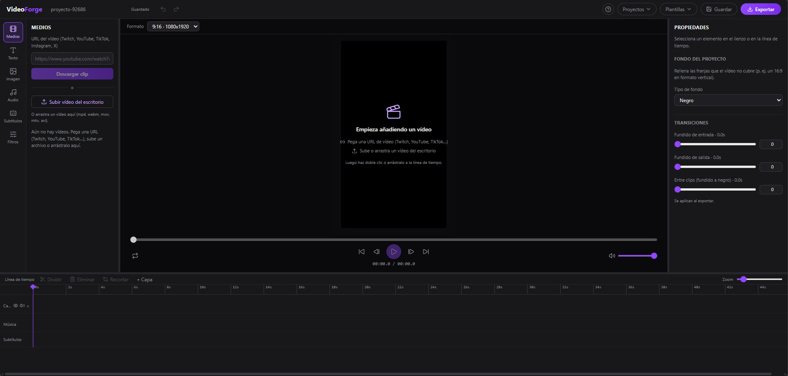

# VideoForge

Editor de vídeo local: sube un vídeo del escritorio o descarga un clip de Twitch
por su URL y edítalo en una línea de tiempo multipista con capas — múltiples pistas
de vídeo apiladas (con opacidad y reordenación), texto e imágenes superpuestas
(arrastrables, redimensionables y rotables), música de fondo con volumen y mute por
carril, velocidad y filtros de color por clip, fondo de relleno (color/desenfoque/imagen),
marcas de agua reutilizables y subtítulos automáticos karaoke — y expórtalo con
FFmpeg a vídeo vertical (9:16), horizontal (16:9), cuadrado (1:1) o 4:5, listo
para TikTok, Reels, Shorts o YouTube.

Aplicación de un solo usuario, sin autenticación y sin despliegue: se arranca en
local y se abre en el navegador. Pensada para Windows.



## Requisitos

- **Node.js 22+**
- **Windows** (los binarios de yt-dlp y las fuentes de texto asumen rutas de Windows)
- Conexión a internet en el primer arranque (descarga automática de yt-dlp; FFmpeg
  viene incluido vía `ffmpeg-static`)

## Puesta en marcha

La forma más cómoda en Windows: **doble clic en `VideoForge.cmd`** (en la raíz
del proyecto). Instala las dependencias la primera vez, arranca la app y la abre
en el navegador automáticamente. Deja esa ventana abierta mientras la usas;
ciérrala para detener la app. Puedes crear un acceso directo a `VideoForge.cmd`
en el escritorio.

Alternativa por terminal:

```bash
npm install
npm run dev
```

`npm run dev` levanta a la vez el servidor (http://127.0.0.1:3001) y el cliente
(http://localhost:5173). Abre **http://localhost:5173** en el navegador.

En el primer arranque el servidor descarga `yt-dlp` (canal nightly) en
`data/bin/`; verás una pantalla de preparación hasta que esté listo.

## Cómo se usa

1. **Medios** → pega la URL de un clip de Twitch y pulsa *Descargar clip*, o
   sube/arrastra un vídeo del escritorio.
2. **Doble clic** en el medio (o arrástralo) para colocarlo en el timeline.
   Suéltalo entre dos carriles para crear una capa nueva al estilo Adobe.
3. Edita en el timeline:
   - **Arrastra y recorta** bloques en cualquier carril.
   - **Reordena capas** arrastrando la cabecera del carril (el orden determina
     qué queda encima en el vídeo exportado).
   - **Ojo / altavoz** en cada carril para ocultar o mutear la capa.
   - Añade **Texto** e **Imagen** (arrástralos, redimensiónalos por las esquinas
     y rótalos en el lienzo), sube **Música** por carril.
4. **Propiedades** (panel derecho con el clip seleccionado): ajusta **Velocidad**,
   **Filtros** de color, **Opacidad** y **Volumen** del clip individualmente.
   Sin nada seleccionado, el panel ofrece el **fondo** del proyecto
   (negro/color/desenfoque/imagen) para rellenar las franjas.
5. **Subtítulos** → elige idioma (o autodetectar) y *Generar subtítulos*:
   transcribe el audio con whisper.cpp y crea subtítulos karaoke (palabra
   resaltada) editables en texto, tiempos (bloques en el timeline) y estilo.
6. **Guardar** / menú **Proyectos** conservan el trabajo (autoguardado cada 5 s).
   El menú **Plantillas** guarda y reaplica formato + textos + imágenes.
   En **Imagen** puedes guardar **marcas de agua** reutilizables.
7. **Exportar** → elige calidad (TikTok / YouTube / Máxima), y usa el diálogo
   *Guardar como* para elegir nombre y carpeta. Al terminar puedes abrir la
   carpeta directamente desde la app.

> La primera vez que generes subtítulos, VideoForge descarga whisper.cpp y su
> modelo (~150 MB) en `data/bin/`. Requiere el Microsoft Visual C++
> Redistributable (presente en la mayoría de Windows).

## Atajos de teclado

| Tecla | Acción |
|---|---|
| Espacio | Reproducir / pausar |
| S | Dividir el clip en el playhead |
| Supr / Retroceso | Eliminar el elemento seleccionado |
| Ctrl+Z / Ctrl+Y | Deshacer / rehacer |
| Ctrl+S | Guardar el proyecto |
| Flechas | Mover el overlay seleccionado (Shift acelera) |
| ← → | Sin selección: mover el playhead fotograma a fotograma |
| Escape | Deseleccionar / cerrar menús |
| ? | Ayuda de atajos |

## Arquitectura

Monorepo de workspaces npm:

```
twitch-clip/
├── client/   Vite + React 19 + TypeScript + Tailwind v4 + Zustand + Konva
│   └── src/
│       ├── components/   shell (TopBar, ToolRail, AppShell, diálogos)
│       ├── features/     media, preview, timeline, properties, image,
│       │                 audio, projects, export
│       ├── stores/       projectStore (historial undo/redo), uiStore, ...
│       └── lib/          coordenadas normalizadas, lógica de timeline, atajos
├── server/   Fastify 5 + TypeScript (NodeNext) + execa + Zod
│   └── src/
│       ├── routes/       clips, projects, assets, export, presets, setup
│       ├── services/     descarga (yt-dlp), binarios, repos, ffmpeg/ (builder
│       │                 del filter_complex, drawtext, geometría, presets)
│       └── lib/          paths, validación de URLs, sniffers de magic bytes
├── shared/   tipos y esquemas Zod del modelo Project, export y plantillas
└── data/     workspace local (gitignored): clips, assets, projects, presets,
              exports, bin
```

- **Modelo de capas media v4**: vídeo, imagen y texto conviven en una lista
  ordenada de capas (`layers`). El orden determina el z-index tanto en preview
  como en el `filter_complex` de exportación.
- **Previsualización 100 % en el cliente**: `<video>` nativo compositado por
  capas en el DOM + capa Konva para los handles de los overlays + filtros CSS.
  FFmpeg solo interviene al exportar.
- **Coordenadas normalizadas (0–1)** en el modelo → las plantillas y los cambios
  de formato no recalculan posiciones.
- **Exportación**: el `Project` se traduce a un grafo `filter_complex` (segmentos
  de clip sobre fondo negro, concat, overlays por orden de capa, drawtext, mezcla
  de audio) que se ejecuta con FFmpeg vía execa; el progreso llega por SSE y se
  puede cancelar.

## Scripts

| Comando | Acción |
|---|---|
| `npm run dev` | Servidor + cliente en modo desarrollo |
| `npm run test` | Tests (Vitest) de los tres workspaces |
| `npm run typecheck` | Comprobación de tipos de los tres workspaces |
| `npm run build -w @clipforge/client` | Build de producción del cliente |

## Seguridad

App local en `127.0.0.1`. Allowlist de dominios de Twitch para la descarga;
FFmpeg y yt-dlp se invocan con execa (array de argumentos, nunca shell); los
nombres de archivo se sanean (sin path traversal) y los uploads se verifican por
magic bytes; los colores de texto se validan como hex estricto antes de entrar al
`filter_complex`.

## Limitaciones conocidas

- Solo Windows (rutas de binarios y fuentes TTF del sistema).
- La paridad visual entre la preview (CSS/Konva) y el MP4 (FFmpeg) es muy alta
  pero no píxel-perfect en métricas finas de texto.

## Licencia

**GNU General Public License v3.0** — ver [LICENSE](./LICENSE).

Puedes usar, modificar y distribuir este proyecto libremente siempre que:

- Mantengas la atribución original (copyright).
- Publiques el código fuente de cualquier versión modificada bajo la misma licencia.

La idea es que las mejoras vuelvan a este repositorio y el proyecto crezca en comunidad, no en forks privados. Si construyes algo encima de VideoForge, considera abrir un PR.

© 2026 Saúl Trujillo Rodríguez ([@Saultr21](https://github.com/Saultr21)) — https://github.com/Saultr21/video-forge
